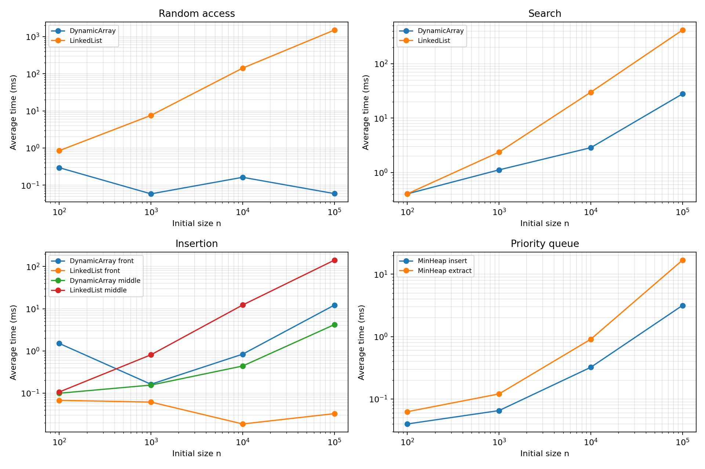
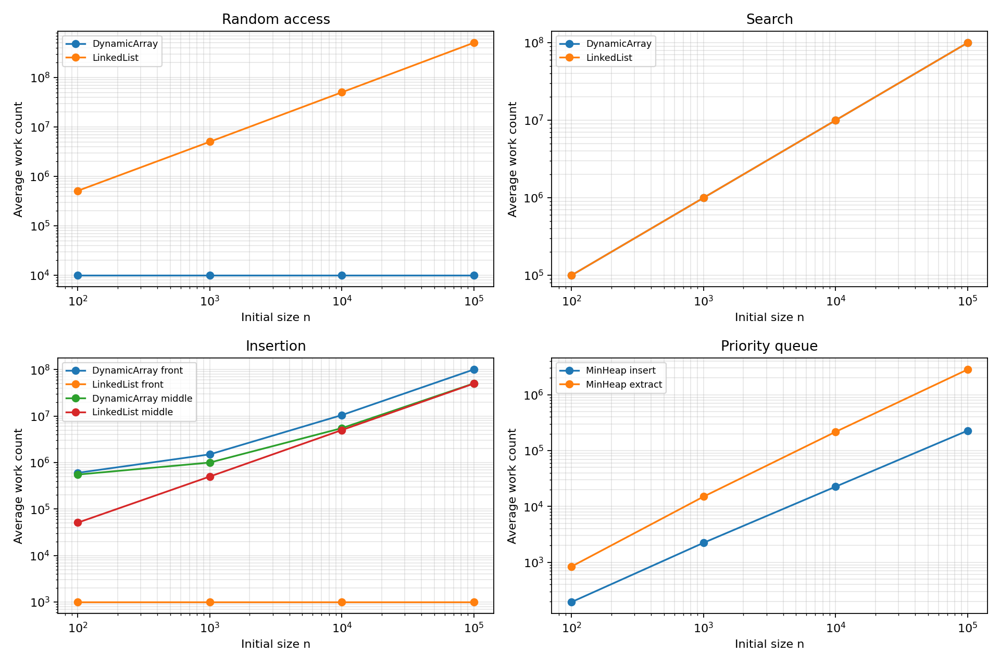

# Assignment 2: Data Structures and Performance

**Name:** Maussymzhan Makazhan  
**Group:** SE-2527

## 1. Overview

This project implements a dynamic array, a singly linked list, and a min-heap using integers. The goal is to compare correctness, theoretical complexity, and measured performance. The structures use plain arrays and nodes. Java collections appear only in the tests as reference implementations.

| File | Purpose |
| --- | --- |
| [DynamicArray.java](src/main/java/kz/aitu/daa/assignment2/DynamicArray.java) | Resizable array with indexed operations. |
| [SimpleLinkedList.java](src/main/java/kz/aitu/daa/assignment2/SimpleLinkedList.java) | Singly linked list with head and tail pointers. |
| [MinHeap.java](src/main/java/kz/aitu/daa/assignment2/MinHeap.java) | Array-based binary min-heap. |
| [Benchmark.java](src/main/java/kz/aitu/daa/assignment2/Benchmark.java) | Four workloads, timing, counters, and CSV output. |
| [src/test/java](src/test/java/kz/aitu/daa/assignment2) | Correctness tests against Java collections. |

### Run the project

Requirements: JDK 17 or newer, Maven, and Python with Matplotlib only if regenerating plots.

```bash
mvn clean test
mvn exec:java
python plot_results.py
```

Run these commands from the project directory. `mvn exec:java` writes [results.csv](results/tables/results.csv). The Python command reads that CSV and writes the two PNG plots. The Java source targets Java 17. The recorded experiment below ran on Windows with Java 25.

## 2. Complexity Analysis

Here `n` is the current number of elements. Auxiliary space means extra space for one operation, excluding the structure's normal `O(n)` storage. `Θ(f)` is a tight bound: it means both `O(f)` and `Ω(f)`. An `O(f)` bound states an upper limit; an `Ω(f)` bound states a lower limit.

| Structure | Operation | Best | Average | Worst | Auxiliary space |
| --- | --- | --- | --- | --- | --- |
| Dynamic array | `add(x)` | `Θ(1)` | amortized `Θ(1)` | `Θ(n)` on resize | `O(n)` on resize, else `Θ(1)` |
| Dynamic array | `add(index,x)` | `Θ(1)` at end | `Θ(n)` | `Θ(n)` | `O(n)` on resize, else `Θ(1)` |
| Dynamic array | `remove(index)` | `Θ(1)` at end | `Θ(n)` | `Θ(n)` | `Θ(1)` |
| Dynamic array | `get(index)` | `Θ(1)` | `Θ(1)` | `Θ(1)` | `Θ(1)` |
| Dynamic array | `contains(x)` | `Θ(1)` | `Θ(n)` | `Θ(n)` | `Θ(1)` |
| Linked list | `add(x)` | `Θ(1)` | `Θ(1)` | `Θ(1)` | `Θ(1)` |
| Linked list | `add(index,x)` | `Θ(1)` at head or tail | `Θ(n)` | `Θ(n)` | `Θ(1)` |
| Linked list | `remove(index)` | `Θ(1)` at head | `Θ(n)` | `Θ(n)` | `Θ(1)` |
| Linked list | `get(index)` | `Θ(1)` at head | `Θ(n)` | `Θ(n)` | `Θ(1)` |
| Linked list | `contains(x)` | `Θ(1)` | `Θ(n)` | `Θ(n)` | `Θ(1)` |
| Min-heap | `insert(x)` | `Θ(1)` | amortized `O(log n)` | `Θ(n)` if array resizes, otherwise `Θ(log n)` | `O(n)` on resize, else `Θ(1)` |
| Min-heap | `peekMin()` | `Θ(1)` | `Θ(1)` | `Θ(1)` | `Θ(1)` |
| Min-heap | `extractMin()` | `Θ(1)` | `O(log n)` | `Θ(log n)` | `Θ(1)` |

The average indexed-operation bounds assume an approximately uniform index. Average search assumes a match is not always at the first element; the measured search workload uses absent values. Array access uses one address calculation. Linked-list access follows one `next` link per position, so even though both structures store `n` values, their `get(index)` costs differ. A linked-list middle insertion must first find the previous node. At the head it changes links without shifting other elements. The tail pointer makes `add(x)` constant time.

The dynamic array doubles capacity when full. A resize copies `n` elements, but over many appends the total copying is linear, so one append is amortized `Θ(1)`. The heap also doubles its array. Its normal sift-up takes at most the heap height, `O(log n)`, but an individual resize can take `Θ(n)`. The heap's root is the minimum, so `peekMin()` is constant time. After extraction, sift-down may follow the height of the tree. For nonempty input every operation also has an `Ω(1)` lower bound because it must do at least one step. Unsuccessful `contains` has the stronger `Ω(n)` bound because it inspects every element.

## 3. Correctness: Two Loop Invariants

### 3.1 Dynamic array `add(index, x)`

The loop shifts elements from right to left. Let `oldSize` be the size before insertion.

1. **Invariant:** At the start of an iteration with loop variable `i`, each original element at an index `j` with `i <= j < oldSize` is already at `j + 1`. Every original element before `i` is still at its original index.
2. **Initialization:** The loop starts at `i = oldSize`. No element has been shifted yet, so the statement is true.
3. **Maintenance:** The assignment `data[i] = data[i - 1]` moves the original element at `i - 1` right by one. The loop decreases `i`, so the invariant holds for the next iteration. Shifting right to left prevents overwriting a value before it is copied.
4. **Termination:** The loop stops when `i == index`. Every original element from `index` to `oldSize - 1` is now at its old index plus one. Elements before `index` are unchanged.
5. **Correctness:** Writing `x` at `index` fills the free position. Increasing `size` gives exactly the old sequence with `x` inserted at the requested position. If capacity was full, the earlier copy to a larger array preserved all old values before the shift began.

### 3.2 Min-heap `insert(x)`

The heap stores the new value in a local variable and moves larger parents down until the right position is found.

1. **Invariant:** At the start of each sift-up iteration, the old heap elements still satisfy the min-heap order except possibly at the edge between the new value's current position `i` and its parent. The position `i` is the open place for the new value.
2. **Initialization:** Adding one place at the end does not change any old parent-child relation. Only the new value might be smaller than its parent.
3. **Maintenance:** If the parent is larger than `x`, moving that parent down into the open place keeps the lower part ordered. The open place moves to the parent's old position. The only possible remaining violation is now one level higher, so the invariant remains true.
4. **Termination:** The loop stops at the root or when the parent is no larger than `x`.
5. **Correctness:** Putting `x` in the open place satisfies its relation with its parent. The lower part was kept ordered by the invariant. Therefore every parent is no larger than its children, and the min-heap property holds.

## 4. Experimental Setup

The four fixed workloads use `n = 100, 1,000, 10,000, 100,000`. Here `n` is the initial structure size; `m` is the number of measured operations. Each case runs five times and the CSV reports the arithmetic mean. A new `Random(42)` generates the same values for both list structures at each `n`. Values are nonnegative; the 1,000 search targets are negative, so every search is unsuccessful and makes exactly `n` value comparisons. Input data, random indices, structure setup, printing, and CSV writing are outside the timed sections. Timing uses `System.nanoTime()`.

| Workload | Operations per run | Recorded work count |
| --- | --- | --- |
| Random access | 10,000 random `get(index)` calls | Array reads or linked nodes visited. |
| Search | 1,000 `contains(value)` calls | Value comparisons. |
| Insertion and removal | 1,000 calls at index `0`, then separately at original `n / 2` | Array elements shifted or copied; linked nodes visited plus one structural touch per update. |
| Priority processing | `n` inserts into an empty heap, then `n` extractions | Comparisons between heap values. |

For insertion, the list starts with `n` values and grows. For removal, it is restored to the original `n` values first. At `n = 100`, 1,000 consecutive removals are impossible. The benchmark therefore uses several batches, each starting from the same original `n` values. It times only removals and sums their times and work counts until exactly 1,000 removals are measured. Rebuilding between batches is outside the timer. The middle index stays equal to the original `n / 2` throughout a batch. This keeps the workload valid without hiding setup time inside the measurement.

The `work` count has a different unit for different workloads, so compare counts only within the same workload. A linked-list structural touch is one completed add or remove, not every individual pointer assignment. Heap comparisons exclude array-resize copying. The benchmark checks that extracted heap values are in non-decreasing order after timing. Short timings can vary because of JVM warm-up, JIT compilation, garbage collection, CPU scheduling, and cache effects. Counts are more stable than time.

## 5. Results

These are averages from one local run. Times are in milliseconds. The full 56-row dataset, including the work metric and theoretical bound for each case, is in [results.csv](results/tables/results.csv). `A` means dynamic array, `L` means linked list.

### Random access: 10,000 gets

| n | A time | A accesses | L time | L node accesses | Theory for A / L |
| ---: | ---: | ---: | ---: | ---: | --- |
| 100 | 0.295 | 10,000 | 0.848 | 511,327 | `O(m)` / `O(mn)` |
| 1,000 | 0.058 | 10,000 | 7.553 | 5,021,262 | `O(m)` / `O(mn)` |
| 10,000 | 0.163 | 10,000 | 141.560 | 50,188,951 | `O(m)` / `O(mn)` |
| 100,000 | 0.059 | 10,000 | 1,494.199 | 504,940,938 | `O(m)` / `O(mn)` |

### Search: 1,000 absent values

| n | A time | A comparisons | L time | L comparisons | Theory for both |
| ---: | ---: | ---: | ---: | ---: | --- |
| 100 | 0.404 | 100,000 | 0.404 | 100,000 | `Θ(mn)` |
| 1,000 | 1.115 | 1,000,000 | 2.363 | 1,000,000 | `Θ(mn)` |
| 10,000 | 2.853 | 10,000,000 | 29.921 | 10,000,000 | `Θ(mn)` |
| 100,000 | 27.809 | 100,000,000 | 415.745 | 100,000,000 | `Θ(mn)` |

### Insertion and removal: 1,000 operations each

Each `work` value is the count of shifts/copies for the array or node visits/link updates for the list. `Front` means index `0`; `middle` means the original `n / 2`.

| Operation | n | A time | A work | L time | L work | Theory for A / L |
| --- | ---: | ---: | ---: | ---: | ---: | --- |
| Insert front | 100 | 1.505 | 601,420 | 0.068 | 1,000 | `O(mn+m²)` / `O(m)` |
| Insert front | 1,000 | 0.163 | 1,500,524 | 0.062 | 1,000 | `O(mn+m²)` / `O(m)` |
| Insert front | 10,000 | 0.838 | 10,499,500 | 0.019 | 1,000 | `O(mn+m²)` / `O(m)` |
| Insert front | 100,000 | 12.159 | 100,499,500 | 0.033 | 1,000 | `O(mn+m²)` / `O(m)` |
| Remove front | 100 | 0.212 | 49,500 | 0.050 | 1,000 | `O(mn)` / `O(m)` |
| Remove front | 1,000 | 0.079 | 499,500 | 0.030 | 1,000 | `O(mn)` / `O(m)` |
| Remove front | 10,000 | 0.656 | 9,499,500 | 0.032 | 1,000 | `O(mn)` / `O(m)` |
| Remove front | 100,000 | 11.862 | 99,499,500 | 0.014 | 1,000 | `O(mn)` / `O(m)` |
| Insert middle | 100 | 0.100 | 551,420 | 0.107 | 51,000 | `O(mn+m²)` / `O(mn)` |
| Insert middle | 1,000 | 0.155 | 1,000,524 | 0.810 | 501,000 | `O(mn+m²)` / `O(mn)` |
| Insert middle | 10,000 | 0.439 | 5,499,500 | 12.248 | 5,001,000 | `O(mn+m²)` / `O(mn)` |
| Insert middle | 100,000 | 4.195 | 50,499,500 | 140.931 | 50,001,000 | `O(mn+m²)` / `O(mn)` |
| Remove middle | 100 | 0.027 | 24,500 | 0.073 | 51,000 | `O(mn)` / `O(mn)` |
| Remove middle | 1,000 | 0.046 | 249,500 | 0.773 | 501,000 | `O(mn)` / `O(mn)` |
| Remove middle | 10,000 | 0.330 | 4,499,500 | 13.480 | 5,001,000 | `O(mn)` / `O(mn)` |
| Remove middle | 100,000 | 4.275 | 49,499,500 | 131.476 | 50,001,000 | `O(mn)` / `O(mn)` |

### Priority processing: `n` heap inserts, then `n` extractions

| n | Insert time | Insert comparisons | Extract time | Extract comparisons | Theory for both total phases |
| ---: | ---: | ---: | ---: | ---: | --- |
| 100 | 0.040 | 194 | 0.063 | 841 | `O(n log n)` |
| 1,000 | 0.065 | 2,232 | 0.121 | 14,994 | `O(n log n)` |
| 10,000 | 0.322 | 22,593 | 0.906 | 216,736 | `O(n log n)` |
| 100,000 | 3.151 | 227,662 | 16.761 | 2,831,463 | `O(n log n)` |

### Plots

Both axes use logarithmic scales so small and large results remain visible. The plots show access, search, insertion, and heap priority processing. All insertion and removal cases remain in the tables and CSV.





## 6. Performance and Design Analysis

1. **How does increasing `n` affect each workload?** Array random access remains at 10,000 accesses because `m` is fixed. Linked-list random access rises from about 0.5 million to 505 million node accesses. Both searches make exactly `m*n` comparisons. Array front shifts and linked-list middle traversals rise with `n`. Heap insert/extract totals rise as more values are processed.
2. **Which results agree with theory?** The access and comparison counts match the stated bounds directly. Linked-list head insertion/removal use 1,000 counted link changes at every `n`. Heap extraction comparisons rise roughly as `n log n`. The heap's random inserts made about 2.3 comparisons per value at large `n`, which is below the worst-case `O(log n)` bound and does not contradict it.
3. **Where do results differ?** The small timing measurements are not monotonic: array access at `n = 100` is slower than at `n = 1,000`, and front insertion at `n = 100` is slower than at `n = 1,000`. JVM warm-up and timer noise dominate work that lasts a fraction of a millisecond. The count trends are clearer. Complexity describes growth, not exact milliseconds for every point.
4. **Why can equal Big-O costs have different times?** Both unsuccessful searches are `Θ(n)`, but at `n = 100,000` the array took about 27.8 ms and the list about 415.7 ms for 1,000 searches. Array values are stored together, while list traversal follows references across separate nodes.
5. **How do constants and implementation details matter?** Arrays copy or shift many values, but contiguous memory is cache-friendly. Lists avoid shifting at the head, but allocate nodes and follow pointers in the middle. A heap also does array resizing occasionally. JIT compilation, garbage collection, and CPU cache behavior change measured time without changing the asymptotic bound.
6. **Why choose a dynamic array?** It is strong for random indexed reads, appending, and often linear search. At `n = 100,000`, its 10,000 random gets took about 0.059 ms versus about 1,494 ms for the list in this run.
7. **When is a linked list useful?** Frequent head insertion/removal is a good fit. At `n = 100,000`, each 1,000-operation phase used only 1,000 counted structural touches. It is not a good choice for frequent indexed reads or middle operations that must first traverse nodes.
8. **Why use a heap for priorities?** The minimum is always at the root. `peekMin()` is `Θ(1)`, and insert/extract use a tree path of at most `O(log n)` levels unless an insert resizes the backing array. The benchmark verified sorted extraction.
9. **How does workload affect the choice?** Choose a dynamic array for indexing, a linked list for repeated head changes, and a min-heap when the next smallest item must be processed repeatedly. The best structure depends on which operation is common, not on one overall ranking.

## 7. Design Recommendations

For a program that frequently reads `get(i)`, use the dynamic array. For a queue-like workload that repeatedly changes the front and rarely requests an arbitrary index, this linked list is reasonable. For a scheduler or task queue that repeatedly selects the smallest priority, use the min-heap. None of these structures is best at every operation.

## 8. Conclusion

The tests passed and the work counts support the main theoretical predictions. Timings show the practical trade-off: arrays are fast for indexed access, linked lists are efficient at the head, and heaps efficiently maintain a minimum. I learned that a correct Big-O label is only one part of a useful performance comparison. The workload, memory layout, and the way the experiment is measured also matter.
